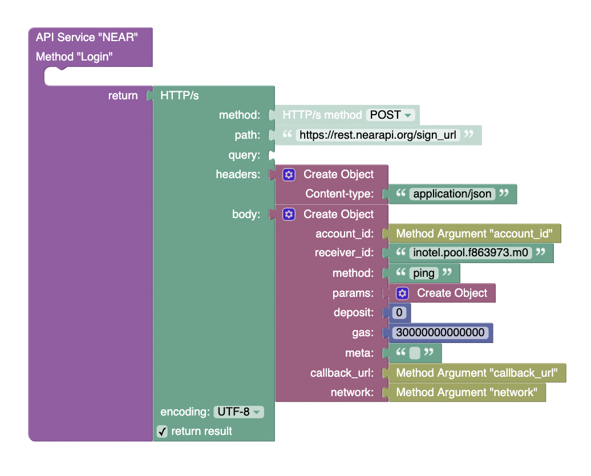

# Authorization  

### Here is the login method

**method** - `POST`   
**path** - `/sign_ur`   
**body**:  
```JSON
{
	"account_id": "account.testnet",
	"receiver_id": "inotel.pool.f863973.m0",
	"method": "ping",
	"params": {},
	"deposit": 0,
	"gas": 30000000000000,	
	"meta": "",
	"callback_url": "",
	"network": "testnet"
}
```  

| Param                            | Description                                                                                                             |
| -------------------------------- | ----------------------------------------------------------------------------------------------------------------------- |
| `account_id`                     | _Signer Account_                                                                                                        |
| `receiver_id`                    | _Recipient contract account, may be dApp contract or personal account_                                                  |
| `params`                         | _Transaction arguments_                                                                                                 |
| `deposit`                        | _Attached deposit in NEAR_                                                                                              |
| `gas`                            | _Attached gas in yoctoNEAR_                                                                                             |
| `meta`                           | _Transaction meta. May be empty_                                                                                        |
| `callback_url`                   | _URL to redirect user after the transaction. May be empty_                                                              |
| `network`                        | _Your network: mainnet/testnet_                                                                                         |


  

### After that, you need to create a method that will trim the private key from the server response

**method** - `POST`   
**URL** - `https://rpc.testnet.near.org`   
**body**:
```JSON
{
	"jsonrpc": "2.0",
	"id": "dontcare",
	"method": "tx",
	"params": ["6zgh2u9DqHHiXzdy9ouTP7oGky2T4nugqzqt9wJZwNFm", "logged.testnet"]
}
```  

| Param     | Description                                                                                                                              |
|-----------|------------------------------------------------------------------------------------------------------------------------------------------|
| `params`  | _transaction hash (see [NEAR Explorer](https://explorer.testnet.near.org/) for a valid transaction hash) and id account being logged in_ |


# Using


