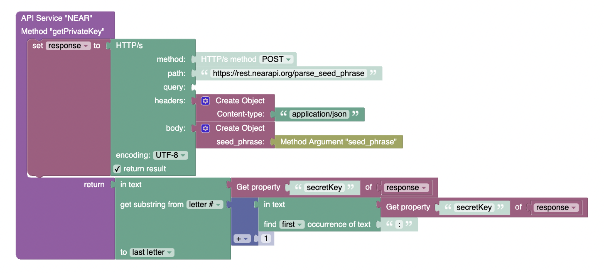
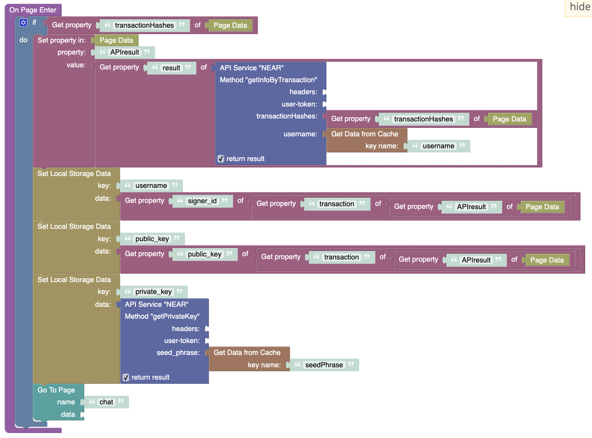

# Parse seed phrase  

### This is a method that allows you to get a private key from a seed phrase  

**method** - `POST`  
**path** - `/parse_seed_phrase`  
**body**: 
```JSON
{
  "seed_phrase" : "witch collapse practice feed shame open despair creek road again ice least"
}
```     

| Param         | Description                                                |
|---------------|------------------------------------------------------------|
| `seed_phrase` | _This mnemonic phrase can be obtained in your NEAR Wallet_ | 

After receiving a response from the API, it needs to be cut and only the private key is taken

  

# Using 

  
