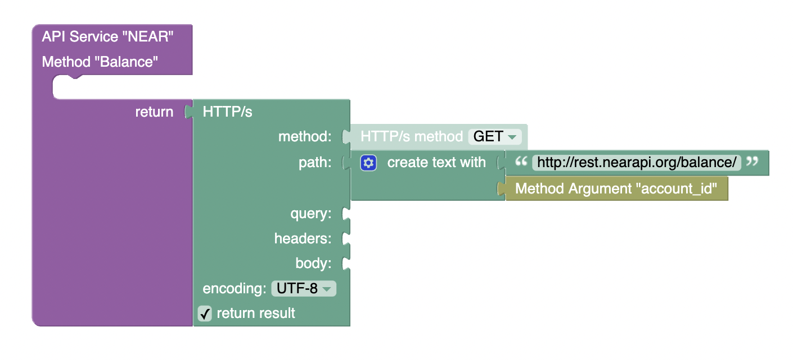
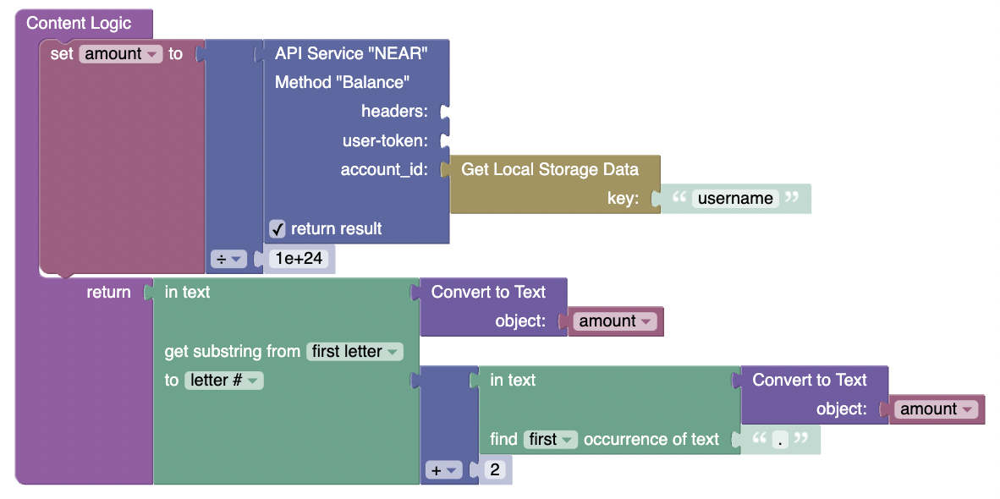

# Get balance  

### This method allows you to find out the balance of an authorized user  

**method** - `GET`  
**path** - `/balnce/{account_id}`  
This request displays the account balance in yoctoNEAR (10^-24 NEAR).

# Using

