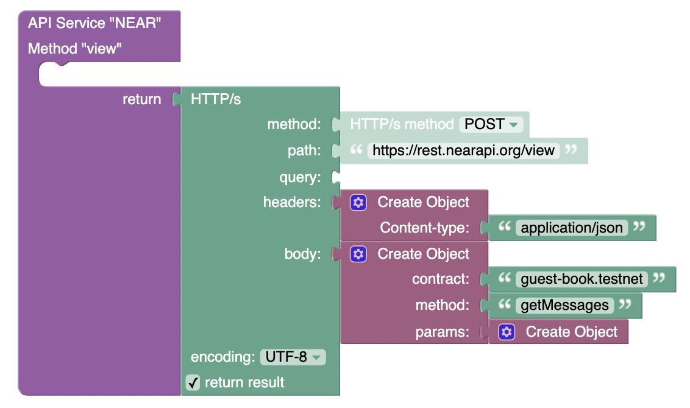
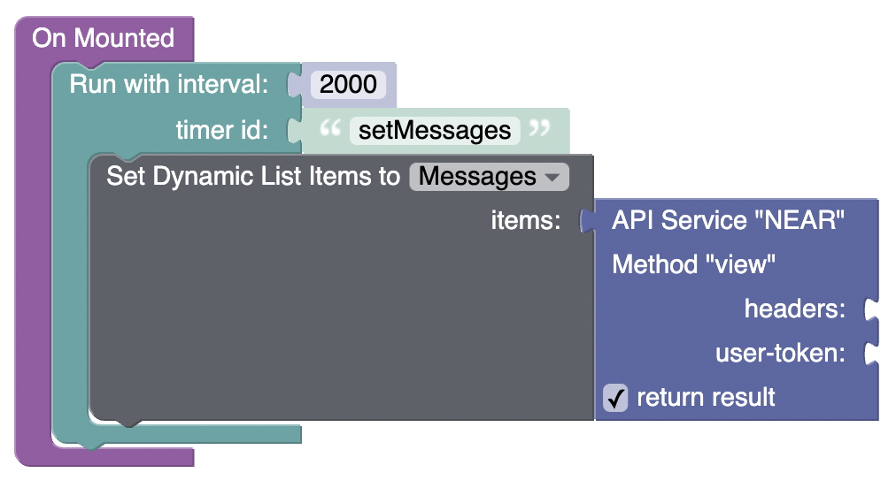

# View method  

**method** - `POST`  
**path** - `/view`  
**body**:
```JSON
{
  "contract": "guest-book.testnet",
  "method": "getMessages"
}
```


| Param      | Description                                                                               |
| ---------- | ----------------------------------------------------------------------------------------- |
| `contract` | _Account id of the smart contract you are calling._                                       |
| `method`   | _Name of the public method on the contract you are calling._                              |

  

# Using

  

