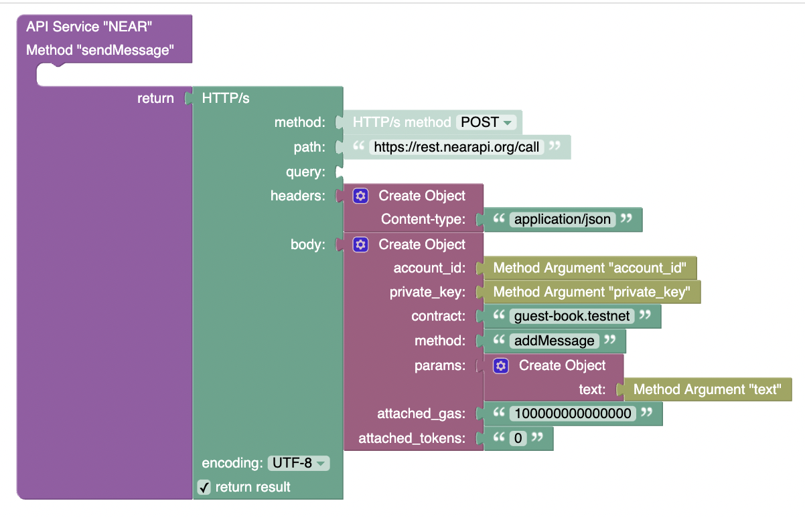
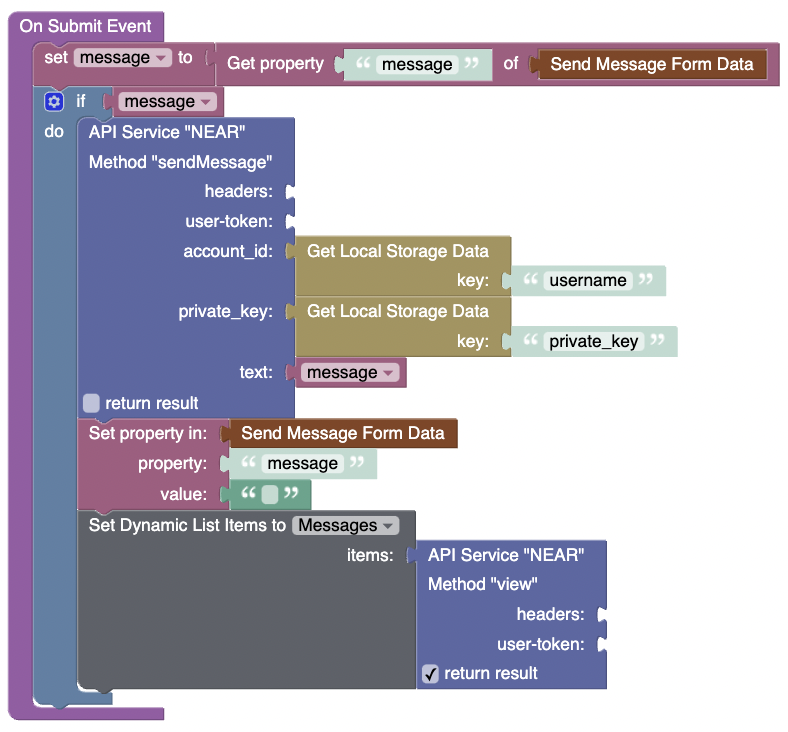

# Call method

**method** - `POST`  
**path** - `/call`  
**body**:
```JSON
{
  "account_id": "account.testnet",
  "private_key": "2Kh6PJjxH5PTTsVnYqtgnnwXHeafvVGczDXoCb33ws8reyq8J4oBYix1KP2ugRQ7q9NQUyPcVFTtbSG3ARVKETfK",
  "contract": "guest-book.testnet",
  "method": "addMessage",
  "params": { "text": "Hello World" },
  "attached_gas": "100000000000000",
  "attached_tokens": "0"
}
```

| Param                            | Description                                                                                                           |
| -------------------------------- | --------------------------------------------------------------------------------------------------------------------- |
| `account_id`                     | _Account id that will be performing the call and will be charged for gas and attached tokens / deposit._              |
| `seed_phrase` _OR_ `private_key` | _Seed phrase OR private key of the account id above._                                                                 |
| `contract`                       | _Account id of the smart contract you will be calling._                                                               |
| `method`                         | _Public method on the smart contract that you will be calling._                                                       |
| `params`                         | _Arguments the method of the contract takes. Pass an empty object if no args are needed._                             |
| `attached_gas`                   | _Amount of gas you will be attaching to the call in [TGas](https://docs.near.org/docs/concepts/gas#thinking-in-gas)._ |
| `attached_tokens`                | _Amount of tokens to be sent to the contract you are calling in yoctoNEAR (10^-24 NEAR)._                             |  

  

# Using

  

