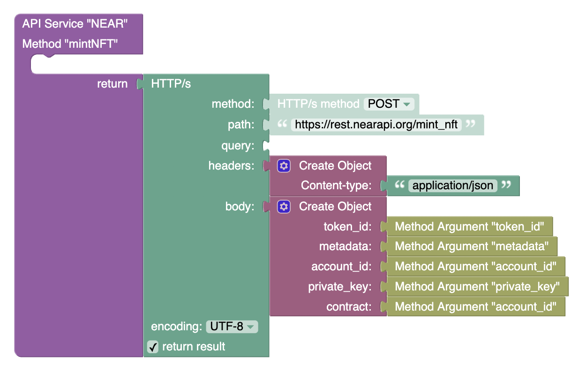
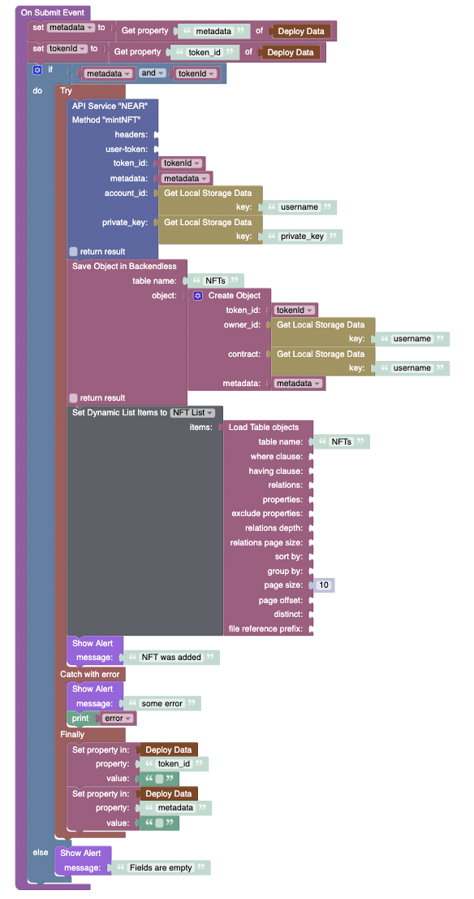

# Mint NFT 

**method** - `POST`  
**path** - `/mint_nft`  
**body**:
```JSON
{
  "token_id": "YOUR-TOKEN",
  "metadata": "https://ipfs.io/ipfs/Qme7ss3ARVgxv6rXqVPiikMJ8u2NLgmgszg13pYrDKEoiu",
  "account_id": "account.testnet",
  "private_key": "41oHMLtYygTsgwDzaMdjWRq48Sy9xJsitJGmMxgA9A7nvd65aT8vQwAvRdHi1nruPP47B6pNhW5T5TK8SsqCZmjn",
  "contract": "nft.example.near"
}
```

| Param                            | Description                                            |
| -------------------------------- |--------------------------------------------------------|
| `token_id`                       | _ID for new token you are minting_                     |
| `metadata`                       | _Metadata for the new token as a string._              |
| `account_id`                     | _Account ID for the new token owner._                  |
| `private_key`                    | _Private key for the NFT contract._                    |
| `nft_contract`                   | _Account ID for the NFT contract your are minting on._ |  



# Using



