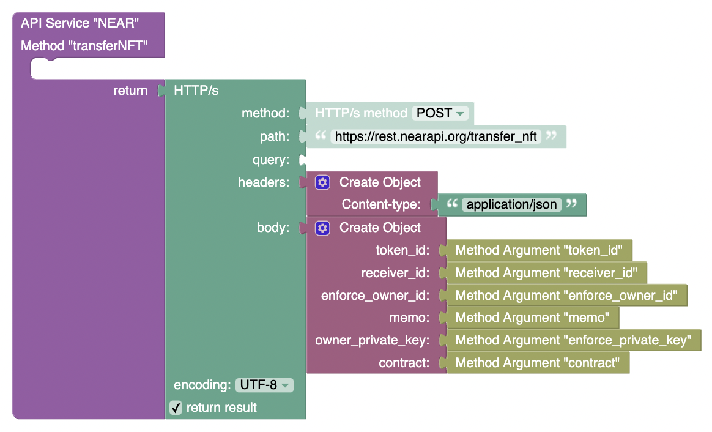

# Transfer NFT

**method** - `POST`  
**path** - `/transfer_nft`  
**body**:
```JSON
{
  "token_id": "EXAMPLE-TOKEN",
  "receiver_id": "receiver.testnet",
  "enforce_owner_id": "example.testnet",
  "memo": "Here's a token I thought you might like! :)",
  "owner_private_key": "YOUR_PRIVATE_KEY",
  "contract": "nft.example.near"
}
```

| Param               | Description                                               |
| ------------------- | --------------------------------------------------------- |
| `token_id`          | _Token ID of the token being transferred_                 |
| `receiver_id`       | _Account ID taking ownership of the NFT_                  |
| `enforce_owner_id`  | _Account ID for the account that currently owns the NFT._ |
| `memo`              | _Optional message to the new token holder._               |
| `owner_private_key` | _Private key of the `enforce_owner_id`._                  |
| `nft_contract`      | _NFT contract that the token being transferred is on._    |


