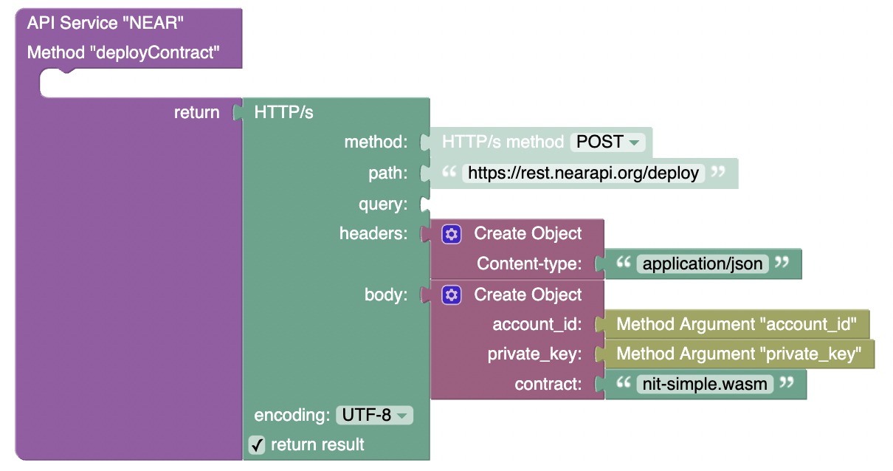

# Deploy contracts

**method** - `POST`  
**path** - `/deploy`  
**body**:
```JSON
{
  "account_id": "example.testnet",
  "private_key": "2Kh6PJjxH5PTTsVnYqtgnnwXHeafvVGczDXoCb33ws8reyq8J4oBYix1KP2ugRQ7q9NQUyPcVFTtbSG3ARVKETfK",
  "contract": "nft_simple.wasm"
}
```

| Param          | Description                                                                          |
|----------------|--------------------------------------------------------------------------------------|
| `account_id`   | _Account id that you will be deploying the contract to._                             |
| `private_key`  | _Private key of the account id above._                                               |
| `contract`     | _wasm file of compiled contract located in the `/contracts` folder of this project._ |

